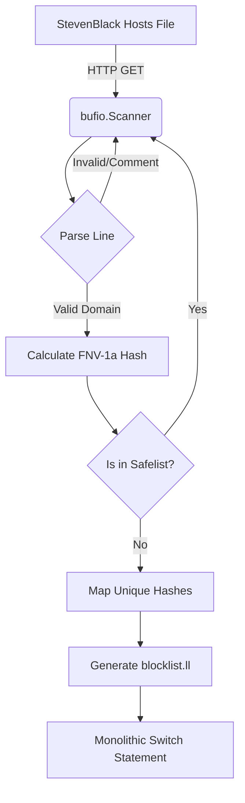
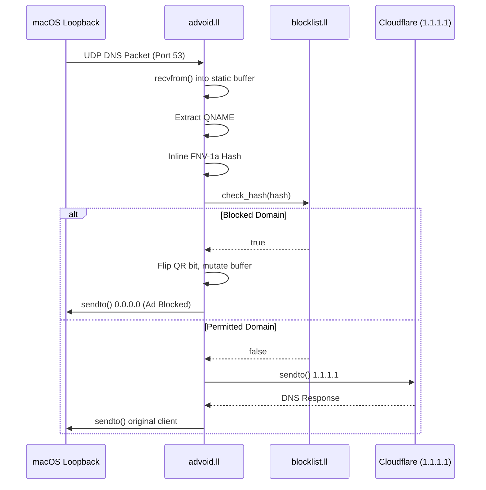

# Architecture

Advoid is divided into three isolated components: the Blocklist Generator, the Packet Engine, and the Menu Bar UI. This design enforces zero memory allocations on the hot path and eliminates runtime dependencies for the packet processing loop.

## 1. Blocklist Generator (Go)

`compile_blocklist.go` operates as an ahead-of-time (AOT) compiler.

- **Fetch & Parse:** Streams the StevenBlack host list via HTTP.
- **Hashing & Filtering:** Computes a 64-bit FNV-1a hash for each parsed domain and filters against a hardcoded Safelist to mitigate upstream poisoning attacks.
- **IR Generation:** Emits raw LLVM Intermediate Representation (`blocklist.ll`), constructing a single `switch` statement mapping ~150,000 hashes to a boolean return.

## 2. Packet Engine (LLVM IR)

`advoid.ll` is the execution engine, written in pure LLVM IR targeting POSIX system calls.

- **Socket Binding:** Requests an IPv4 datagram socket bound to `127.0.0.1:53`.
- **Packet Interception:** Captures UDP payloads into a static stack-allocated buffer via `recvfrom`.
- **Domain Extraction:** Parses the DNS payload manually to extract the QNAME.
- **Inline Hashing:** Computes the FNV-1a hash and jumps via the linked `blocklist.ll` switch block.
- **Zero-Allocation Responses:** Mutates the incoming buffer in-place using packed 64-bit integer instructions (`store i64`) to construct a valid DNS sinkhole response pointing to `0.0.0.0` before issuing `sendto`. Permitted traffic routes to `1.1.1.1`.

## 3. Menu Bar UI & Daemonization (Swift)

`advoid-menu.swift` provides a native macOS interface.

- **Self-Installation:** Checks `/Library/LaunchDaemons` on launch. If absent, dynamically writes an absolute path to its bundled `advoid` binary and uses `NSAppleScript` to request administrator privileges for `launchctl bootstrap`.
- **System DNS Override:** Toggles active network interfaces between `127.0.0.1` and `empty` using `networksetup`, dynamically querying active interfaces to avoid failing on missing hardware (e.g. absent Ethernet).
- **Native Rendering:** The Menu Bar icon uses native template rendering and `alphaValue` modulation for state changes.
